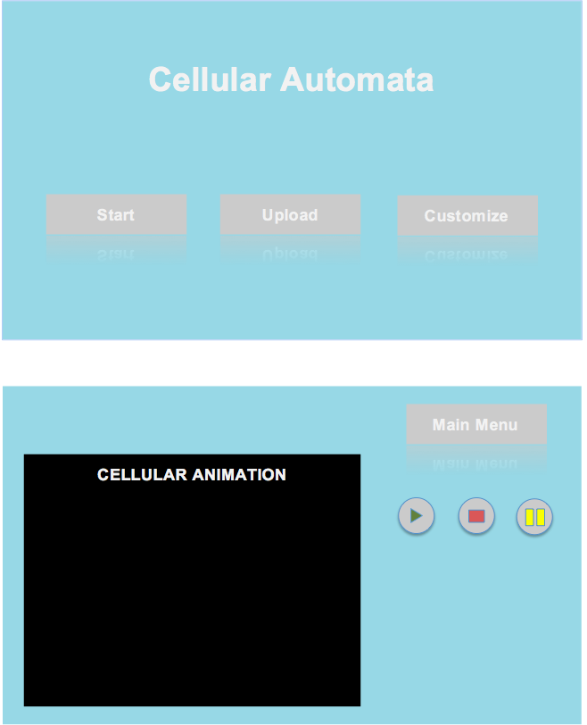

#DESIGN 
====

###Introduction
Cellular automata are mathematical models with simple rules that govern the behavior of cells (i.e. replication and destruction). A simulation contains a grids of cells, each of which has a finite number of states and an initial state. As the simulation runs, the state of each cells is updated simultaneously based on the fixed rules and the neighbors of the cells. Rules are applied to each cell based on their current state, but the cells are not actually updated until a second pass through all the cells (when the rules have been applied to every cell). Our team’s objective is to write a Java program that can animate any cellular automata simulation, where the cells have states and rules, and the grid’s size can be determined by a user of the program. There are a variety of sets of rules that can be applied to the cells (i.e. changing color based on the colors of neighbors, moving to different positions) and the starting configuration as well as simulation type are determined by an XML data file. Our design goals involve writing flexible code, and following proper coding conventions and adhering to the coding standards that professionals follow. Our code should be flexible in that new features can easily be added, such as being able to add many different configuration types. In order to have our code be flexible, we will create several classes for each main feature (i.e. Cell, Grid, etc.) that are open in that they can be extended (new variables and methods can be added). New features would extend from these main features and having classes for them will make it easier to implement additions. 

###Overview
The program is divided up into 4 major parts. There are 2 parts that are dedicated to backend (Structures and Engine), one part that is dedicated to XML parsing / creating (XML), and another part that is dedicated to front-end (Animation). There is also the Main class, but that class will just hold the Stage and call the launch() method and the start() method. In the structures package, there will be classes Grid, Cell, and State. In the Engine package, there will be classes Loop and UpdateGrid. In the XML package there will be classes GenerateFile, ParseFile, and Configuration. In the Appearance package there will be classes MainPage, GridScreen, and any labels / button / other front-end classes we will need. 
The main class will call the UI and launch the main menu. The main menu will just be a GUI. Then, the user can parse in an XML file, if they don’t, there will be a standard cellular automata that the program is set to run on that will automatically run. If the user decides to read in the XML file, they can either upload an XML, or they can use the UI to enter in values that they want to customize. In the background this will call both the ReadFile and the CreateFile classes. Once there is information in the system, this information is stored in the Configuration class as a Java object, and from the Configuration class the information is passed around to the relevant classes (mostly be structural classes such as Cell/State/Grid). The Cell structure is the node that will be part of the graph that we are building in the Grid. The State class will be all the different “States” that the cell can be in and we will implement different States through inheritance or composition. The structures will be pretty encapsulated and will receive information from the XML layer, and will pass information to the Engine layer. The Engine is the actual Loop of the animation. It will pass information directly to the appearance layer (or front-end) and that will determine the animation. 

###User Interface
When the program launches we want the UI to open up to a main screen that has multiple options (buttons). One option will take the user to the XML page. The user will then have buttons that provide options to: 1) upload an XML file, which the machine will parse and run (if this information is erroneous, a pop-up will appear, letting the user know that the XML was not accepted for a certain reason), 2) open up a new page that just allows the user to customize the inputs (without ever having to see the XML), where the user can input certain parameters / make the timeline faster / decide which cellular automata they want to see (if the user inputs a number that doesn’t make sense, once again there will be an error message that appears, that doesn’t allow the user to continue), and 3) return to the Main Screen.
Back on the main screen, the second options will start the GameLoop (aka the step in the back-end), and then it will open up to a display of the actual Cellular Automata. This display will be on a screen inside the UI where the user can stop / play / pause the animation. It would also be nice to have a zoom feature, so the audience can decide how they want to view the animation. 

###Design Details 
As mentioned earlier, the program involves layers. To begin with the bottom layer, an XML file is generated in a Generate class that has variables that correspond with the XML file: title, author, parameters (for rules), type, and dimensions. This class takes in information and writes it into an XML file. Once the XML data has been produced (rules are formatted into an XML file), the data is parsed in a Parse class. This class reads the XML file (which is the input) and writes it into the Configuration class. This class essentially holds the data from the XML file as a Java object. It has getter and setter methods that can access the data fields in the XML file so that this information can be used as rules for the simulation.  
There are classes for the main structures in order to make it easier for new features to be added. The Cell class stores information about a cell, such as the current state of the cell, the previous state of a cell, and getter methods to publicly access this information. The information from a cell that is sent to the frontend is what is displayed on the grid. The Grid class stores the information about the position of cells (Cell objects) relative to one another. We will use a graph to store all of the cells in the grid, where each node in the graph is a cell and an edge between two nodes represents that the two nodes are neighbors. Using a graph to store the grid allows flexibility with neighbor and grid types (i.e. if neighbors involves all 8 surrounding cells in a square grid or all surrounding shapes in a grid of shapes). In order to implement the graph, we will use an adjacency matrix, which will make it easy to access the neighbors of an individual cell, which is important for updating the state of a cell. There is additionally a State class which will have extensions for each possible state, such as StateFire (an extension of the State class to determine if a cell is on fire). The State class will determine what type of state(s) is to be used in the simulation by numbering the states and getting information from the Configuration class. If new types of States need to be added, they can easily be done by creating more extended classes from the State class.
Within the Engine package, there is an Update class, which reads information from the Grid class (gets the information about each cell’s neighbors), and updates the properties of cells. This class has methods to move cells, create the new grid (a new grid is drawn with each step of the simulation), and check the neighbors of cells. The Loop class, which contains the loop of the simulation, repeatedly calls the methods from Update in order to continuously create new grids. Within this class there is an initialization method that will draw the initial state of the cells and then in a step method, a new grid is drawn. 
The Animation package involves the frontend classes. There is a Main class that calls the initialization method in the Loop class, which calls the drawGrid method in the Draw class. This method is called each time the step method in the Loop class is called, and is responsible for creating the visual display of the Grid in the UI. The Draw class contains all methods for drawing each cell and their visual properties. The Draw class is not involved with the logic behind the simulation and simply receives information through the Update class. 
In order to apply the rules of a simulation to a cell, whether it is a middle or edge cell, the Grid class will be used to look at the neighbors of a cell, the properties in the Cell class will be updated accordingly, the Update class will call the Grid class to receive the new information, and Loop class will call the method from the Draw class and the update methods in order for the user to see the change. 
    
###Design Considerations
The biggest design issues we had were how to represent the grid, neighbors, and cells. 
At first, we considered using a 2d array to represent the grid because naturally, a grid is thought of as a 2d array. However, we realized that a 2d array would not be flexible when trying to work with a grid that was not aligned in the format of a 2d array. We wanted our grid data structure to be flexible enough that it could support a grid of any shape, which meant that each node could have a variable amount of adjacent nodes. This led us to consider a graph implementation of the grid. With a graph, we could abstract the concept of a grid to vertices and edges, which have no defined number of neighbors or shapes to the vertices. When thinking about the best way to implement the graph, we considered an adjacency matrix and a vertices and edges implementation. The pros of the adjacency matrix included easier traversal and relatively simple implementation. However, the cons were that the matrix would not be very flexible for grid growth and that it may actually be difficult to update the adjacency matrix by keeping track of indices for each node. We chose to make a graph implementation using nodes/vertices and edges because it would be simple to find neighbors of any distance and it is easy to store information within the nodes/vertices, which will probably be a cell object.
Another design consideration was a way to represent neighbors. Originally, we decided to have a neighbors class so that we could keep track of neighbors by modifying the neighbors class to accommodate for different definitions of neighbors. The cons of this are that we would have to figure out a way to generalize neighbors enough so that different simulations would be able to extend different implementations of neighbors. A different solution was to not have a neighbors class and let our game logic deal with computing the neighbors based on the rules. The pros of this were that we could compute neighbors from the graph based on the input configurations and not have to worry about how to represent neighbors differently each time. The con is that, in reality, it may not be so easy to design a method that takes in these input configurations and generates a different list, or representation, of neighbors each time.
Implementing the state of a cell was another design consideration. It was difficult because we realized that states are not binary and will often be any set of descriptors. For example, we could have a set of states such as hot, warm, room temperature, chilled, freezing, or we could have a set of states such as red, blue, yellow, etc. From this we realized that it is difficult to represent a state without knowing the configurations from the XML file. Therefore, we decided to abstract the idea of a state by assigning any type of state a number. After parsing the XML configurations, the state should be able to handle any number of states and assign each state a number. Then, each number could be mapped to the type of state and the rules of the CA could be abstracted to use these numbers instead of the exact state name.

###Team Responsibilities
Our application is split up into 3 main layers and each group member is responsible for the implementation of each of their assigned layers.
Hannah is responsible for all front-end development that deals with JavaFX and the presentation of the game. She has to design how the game looks to the user and figure out how to pass user input to the next “layer”. She will use Aninda’s endpoints to update the game view.
Aninda is responsible for the game logic that lies between the front-end presentation of the game and the back-end classes that Alan will implement. Aninda will deal with the logic involved in updating the application each application loop. Aninda will use the back-end classes to define the game logic and ultimately provide concise, simple endpoints for Hannah to use in updating the user view.
Alan is responsible for creating and parsing the XML files and defining classes for each of the main structures or abstractions of the game. For example, Alan will read from the XML file and map that to a configuration object. From that object, he has to implement a grid class, cell class, state class, and other classes that hold representations of the data that can be used by Aninda to manipulate as the application loops.
Everyone will take secondary responsibility to make sure that their implementations are compatible with the adjacent “layer”. For example, Alan must make sure that his class implementations are what Aninda will be manipulating in working with game logic. Aninda must make sure that she is providing the endpoints that Hannah expects to use when updating the user view.

#NEW DESIGN 
====

###High-Level Design Goals
The design goal that our team really stressed from the first design analysis was that we wanted to implement a design that was 1) flexible and 2) encapsulated. We ultimately were creating cellular automata and we were to begin with a basic implementation with a few simulations. Our goal was to write this basic implementation in a way that we could easily extend it to add new features. Once we were given the new features, our goal was to implement as many as possible or write our code in a way such that the new features we didn't have could easily be added.
The front-end design struggled with 1) flexibility because for the second sprint the front-end had to be majorly re-designed. However, there was good 2) encapsulation within the front-end and the distinction between the front-end and the back-end. We really thought about how we would divide up the work between the three team members and we were able to complete our three sections almost individually and only needed to meet up to merge the three together at the end of the first sprint. Our original design called for a “three-layered” design approach, and this individuality in the project was a kind-of trade-off because while it kept our code very encapsulated (the front-end did not leak into the back-end), it was hard to merge the two segments at the end. We were able to get a sense of encapsulation in our design because many of the classes we made only talked to the classes that were within our “layer”. For example, in the front-end there are classes that are only called by front-end classes. Also, the front-end and the back-end were very separate, and the other place where there was a strong link between the front-end and the back-end was in the “Loop” class and in the “UserInputToXML” class. In all other instances, the back-end never dealt with JavaFX or touched any GUI elements. 
Originally we really focused on having a flexible design as well, but our design efforts in the original DESIGN.md document focused on making the back-end more flexible. Our back-end was fairly flexible, but in terms of the front-end, there were major rewrites that had to happen in the second sprint because we had no way of predicting the new front-end features that were asked to be implemented. Also, none of us had real experience with front-end so it was hard to predict how to make the front-end flexible.

###Details of Extendability
We ran into many design decisions when trying to incorporate flexibility into our project. Unfortunately, we often would run out of time and have to resort to the quickest method of accomplishing something rather than the best design and there are many features that we wanted to implement but were unable to. But, the final project that we submitted allows for some opportunities for flexibility that our original project (submitted after the first sprint) did not have.
In the front-end, the Menu classes are all extended, so that everytime a new screen is created, adding all the GUIs to the screen is just done in a class that is inherited from the Menu abstract class. If the front-end ever needed to implement a different screen or a pop-up stage it would be fairly simple to just extend the Menu class and write a new class to encapsulate the new Menu class that we would want implemented. In addition, by separating out all the GUI generators (into the different screens), the front-end was able to keep the methods that were specific to each menu in different classes. If we wanted to add another menu, we would simply have to create a new class that generated the GUIs for that menu, and that new class would probably have to communicate with the backend in some way, but because that class was separated out from all the other GUI generators, it would not be messy to implement. 
In the backend, the neighbors classes were created in order to accommodate more cell shapes and grid edge types. Another inheritance hierarchy was created with a parent Neighbor class and child classes that extended this class (one for each cell shape). This design allows for new cell shapes to be added easily. The necessary computation for determining the neighbors with a given cell shape (as well as adding a grid type) should all be in one class and this class needs a method for determining immediate neighbors as well as a method for determining diagonal neighbors, as these are the common features among all neighbors classes. The same idea applies when adding a new simulation, as there is an inheritance hierarchy with the update classes. A new update class would need to be written for a new simulation, but it is not difficult to do so and have it extend the parent update class.
Inheritance really helped with the flexibility of our project because it allowed for other simulations to be added by just extending the parent class and making minor tweaks. After that design pattern had been implemented in the XMLSelections and the Menu classes in the front-end, it was much easier to add new simulations.

###Major Design Choices and Trade-Offs 
We had many major design choices that we actually had to go back and change multiple times. One of the larger design choices that was implemented in the front-end was the inheritance of the Menu classes. The front-end code for this project was shown on Duvall’s lecture screen during class and one of his critiques was that one of the if-else statements could have been made into inheritance. Even though each class only ended up being around 20 lines long, we realized that this was a better design choice because it allowed for greater flexibility within our project. If we ever wanted to add a new screen to our project, we would not need to add another branch to the if-else statement and then add a new method that implemented what was meant to be implemented. Instead, all we had to do was create a new class that extended the parent class and fill in one method. This was a trade-off because while we were skeptical about adding a new class to do a two-line method (and it took time to refactor and pull out), it really did allow for greater flexibility, and although we never needed to implement any new screens, that flexibility exists and could be used. Additionally, we made major design choices regarding how we wanted to implement a cell's state and how we wanted to store the grid of cells. We initially created a class called State that would be used to represent the state of a cell, but we were not sure how a state should be implemented as there are different state options for each simulation and we thought we would use an object to represent these. We had the State class contain arrays mapping different indices to descriptions, but we were ultimately returning a number when the state of a cell was needed. While this design choice allowed for a lot of information to be compiled together so that it is easy to figure out what a state's description is, it is redundant. We could simply return an integer for a cell's state and then keep tracking of the integer representations when implementing the logic for the rules of a simulation. We ended up using an integer because it is easy to keep track of what colors different numbers represent and we avoid the extra complexity of having a State object and potentially needing to create getter and setter methods to access this information. An integer is easy to work with and is informative enough. We also needed a Grid to store all of our Cell objects and the cells in this grid would be displayed as part of a grid on the frontend. Originally, we considered a 2D array as the data structure to store our grid because a 2D array would make it easy to access the location of different cells, as a square grid is essentially a 2D array. However, a 2D array is more difficult to incorporate when the cells are shaped either as hexagons or triangles, as the rows and columns are no longer perfectly aligned. Indexing would be complicated and with the shape of hexagons and triangles since the grid on the fronted would not look like a table and match a 2D array. We then considered a graph, where every cell would be represented with a node and an edge would connect any two nodes that are neighbors. Using a graph is applicable to any cell shape, but is overly complex and more difficult to implement. We ended up using a 1D array of cells that we could organize into a grid based on doing math with the cell numbers, knowing the grid width. This design was easy to implement and worked for all cell shapes.

###Decisions to Simplify Ambiguities 
One of the biggest ambiguities left in our project is that there is a file hard-coded in to the start of our project. This is a fault of not having error checking and it was definitely a design feature that we would have been able to fix with error checking, but we did not have time to implement error checking. It is therefore assumed that the user has this hard coded file. Otherwise, the program will not run. It is also assumed that the user will enter information into the program correctly and not leave any fields blank.
